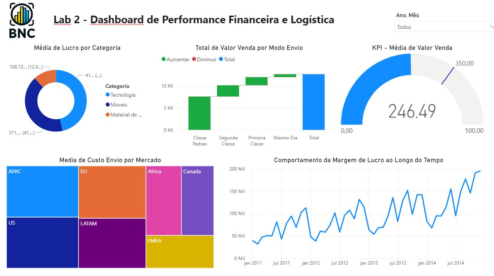

## Dashboard de Performance Financeira e Logística
## 📌 Visão Geral
Este projeto apresenta uma análise profunda sobre a saúde financeira e a eficiência logística de uma operação global. O foco principal foi monitorar não apenas o volume de vendas, mas a rentabilidade real, utilizando cálculos avançados para medir o lucro e as margens por categoria e mercado.

## 📸 Interface do Projeto

  

## 📊 Inteligência de Dados & DAX
Neste projeto, a inteligência do relatório foi construída utilizando a linguagem DAX (Data Analysis Expressions) para extrair métricas que não estavam prontas na base de dados original.

Cálculo de Lucro: Criada medida para subtrair os custos totais (incluindo envio) do valor bruto de venda.

Margem de Lucro: Implementada a fórmula de margem percentual para identificar quais categorias e mercados trazem o melhor retorno sobre o investimento.

KPI de Meta: Utilização de um gráfico de medidor (velocímetro) para comparar o ticket médio atual ($246,49) contra a meta estabelecida ($350,00).

## 🔍 Principais Insights
Evolução da Margem: O gráfico de linhas revela uma tendência de crescimento consistente na margem de lucro entre 2011 e 2014, atingindo picos superiores a 150 mil no último ano.

Análise de Logística (Waterfall): O gráfico de cascata mostra que a "Classe Padrão" de envio é a que mais contribui para o volume total de vendas, permitindo avaliar se o custo de frete está equilibrado com o lucro gerado.

Custos por Mercado (Treemap): Os mercados de APAC e EU apresentam a maior concentração de custos de envio, sendo pontos de atenção para estratégias de otimização logística.

Mix de Produtos: A categoria de Tecnologia lidera a média de lucro, seguida por Móveis e Materiais de Escritório.

## 🛠️ Tecnologias Utilizadas
Power BI Desktop: Construção de dashboards e modelagem de dados.

DAX: Fórmulas para calcular lucro e margem de lucro.

Power Query: Tratamento e limpeza de dados para análise financeira.

Data Visualization: Design focado em Business Intelligence para facilitar a tomada de decisão.
